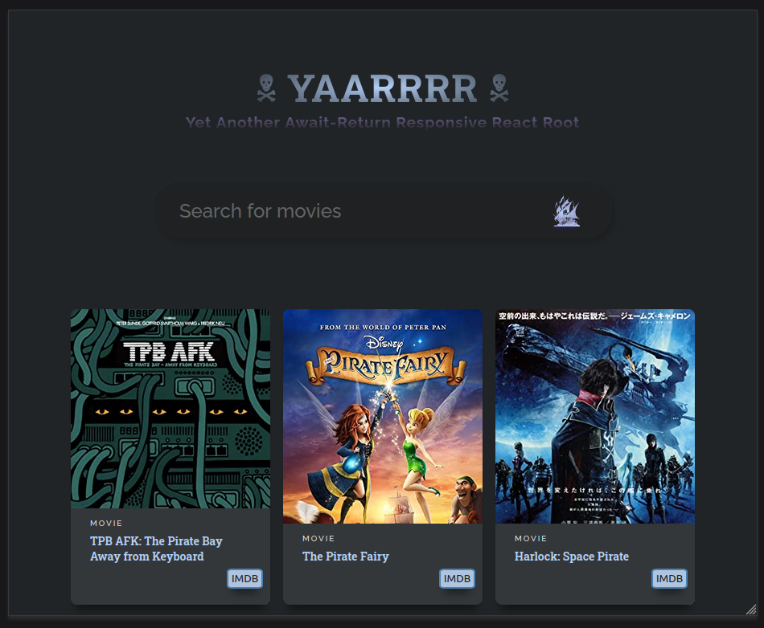

# yaarrrr - Yet Another Await-Return Responsive React Root

This is a React.js application that serves as a movie search app, connected to the OMDB database. With **yaarrrr**, you can easily search for movies by their titles and conveniently navigate to their IMDB or TPB pages.



## Table of Contents

- [Installation](#installation)
- [Dependencies](#dependencies)
- [OMDB API Disclaimer](#disclaimer)

For a more in-depth understanding of how to use and customize the app, please refer to the [full documentation](documentation.md).

## Installation

Follow these steps to install and run the **yaarrrr** app on your local machine:

### Prerequisites

- Node.js: Make sure you have Node.js installed. You can download it from the [official Node.js website](https://nodejs.org/).

### Installation Steps

1. Clone the repository:
   ```bash
   git clone https://github.com/your-username/yaarrrr.git
   ```

2. Navigate to the project directory:
   ```bash
   cd yaarrrr
   ```

3. Install dependencies using npm (Node Package Manager):
   ```bash
   npm install
   ```

### Running the App

After completing the installation steps, you can start the app by running the following command:

```bash
npm start
```

This will launch the app in development mode and open it in your default web browser. You can access the app at [http://localhost:3000](http://localhost:3000).

### Available Scripts

In the project directory, you can run the following scripts:

- `npm start`: Runs the app in development mode.
- `npm build`: Builds the app for production.
- `npm test`: Launches the test runner.
- `npm eject`: Ejects the app from Create React App configuration.

## Dependencies

The following dependencies are required for running **yaarrrr**:

- `@testing-library/jest-dom`: Version "^5.16.4"
- `@testing-library/react`: Version "^13.3.0"
- `@testing-library/user-event`: Version "^13.5.0"
- `react`: Version "^18.1.0"
- `react-dom`: Version "^18.1.0"
- `react-scripts`: Version "5.0.1"
- `web-vitals`: Version "^2.1.4"

## Disclaimer

Please note that the provided OMDB API key in the code (`API_URL = "http://www.omdbapi.com?apikey=b6003d8a"`) is a personal key and should be replaced with your own OMDB API key. You can obtain your API key by signing up on the [OMDB website](http://www.omdbapi.com/apikey.aspx). Using personal API keys is essential for security and rate limiting reasons.

When you obtain your API key, make sure to replace the existing key in the code to avoid any unauthorized usage and to ensure that your application works as intended.

Remember that API keys and sensitive information should not be hard-coded in your codebase when sharing your code publicly or deploying it to production environments. Consider using environment variables or secure configuration management for such sensitive information.

Feel free to customize and enhance **yaarrrr** to suit your needs and requirements.
For a more in-depth understanding of how to use and customize the app, please refer to the [full documentation](documentation.md).
